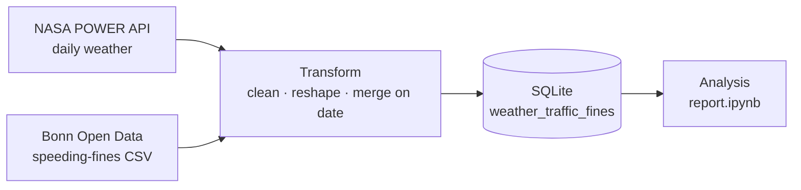

# Weather vs. Traffic-Offense Correlation — Bonn 2022

End-to-end ETL pipeline that analyzes whether weather conditions relate to speeding-offense frequencies in Bonn, Germany. Modular extract/transform/load over two live data sources (NASA POWER + Bonn Open Data), persisted to SQLite, with a pytest suite and GitHub Actions CI.

## Key findings

Across 2022, daily speeding offenses in Bonn correlate most strongly (positively) with **temperature**, and inversely with **wind speed**:

| Weather parameter | Correlation with offenses | Reading |
|---|---|---|
| Temperature (T2M) | **+0.38** | moderate — more offenses in warmer weather |
| Dew point (T2MDEW) | +0.27 | slight positive |
| Specific humidity (QV2M) | +0.26 | slight positive |
| Surface pressure (PS) | +0.04 | negligible |
| Precipitation (PRECTOTCORR) | −0.08 | weak — slightly fewer offenses when raining |
| Wind direction (WD10M) | −0.18 | slight negative |
| Wind speed (WS10M) | −0.24 | fewer offenses on windier days |

Offense counts peak in Q3 (July–September), highest in September — tracking the warmest part of the year. Correlation is not causation: unmodeled factors such as traffic volume and road conditions likely matter too. Full write-up, charts, and caveats are in **[report.ipynb](report.ipynb)**.

## The question

Do weather conditions — temperature, wind, precipitation — relate to how often drivers are fined for speeding? Using a full year of daily data for Bonn (2022), this project builds a reproducible pipeline that joins weather with offense records and measures the relationship.

## Architecture



- **Extract** — `power_api.py` (NASA POWER weather), `mobilithek.py` (Bonn Open Data traffic fines). Each source has remote and local variants behind a small common interface.
- **Transform** — parse dates, aggregate daily offense counts, and merge weather with traffic on date.
- **Load** — write the merged table to SQLite.
- **Orchestrate** — `pipeline.py` wires Extractor → Transformer → Loader.

## Tech stack

Python 3.11 · pandas · SQLite · Requests · PyYAML · pytest · GitHub Actions

## Run it

```bash
git clone git@github.com:shuvanon/weather-traffic-etl.git
cd weather-traffic-etl

python3.11 -m venv .venv
source .venv/bin/activate          # Windows: .venv\Scripts\activate

pip install -r requirements.txt

bash pipeline.sh                   # or: python -m data_pipeline.pipeline
# → writes data/data.sqlite (table: weather_traffic_fines)

bash tests.sh                      # or: pytest tests
```

> Run the commands from the repository root. The pipeline fetches live data from the NASA POWER and Bonn Open Data endpoints, so a network connection is required.

## Project structure

```
.
├── data_pipeline/
│   ├── config.yaml        # location, date range, API parameters
│   ├── extract.py         # Extractor: orchestrates the two sources
│   ├── power_api.py       # NASA POWER weather client
│   ├── mobilithek.py      # Bonn Open Data traffic client
│   ├── transform.py       # date parsing, daily aggregation, merge
│   ├── load.py            # SQLite loader
│   └── pipeline.py        # Extract → Transform → Load
├── tests/                 # pytest: extractor, transformer, loader, pipeline
├── data/                  # SQLite output (gitignored)
├── report.ipynb           # analysis, charts, conclusions
├── exploration.ipynb      # data exploration
├── pipeline.sh
└── tests.sh
```

## Testing & CI

`pytest` covers the extractor, transformer, loader, and the end-to-end pipeline. GitHub Actions runs the suite on every push to `main`.

---

<sub>Originally built for the <em>Methods of Advanced Data Engineering</em> course at FAU Erlangen-Nürnberg.</sub>
